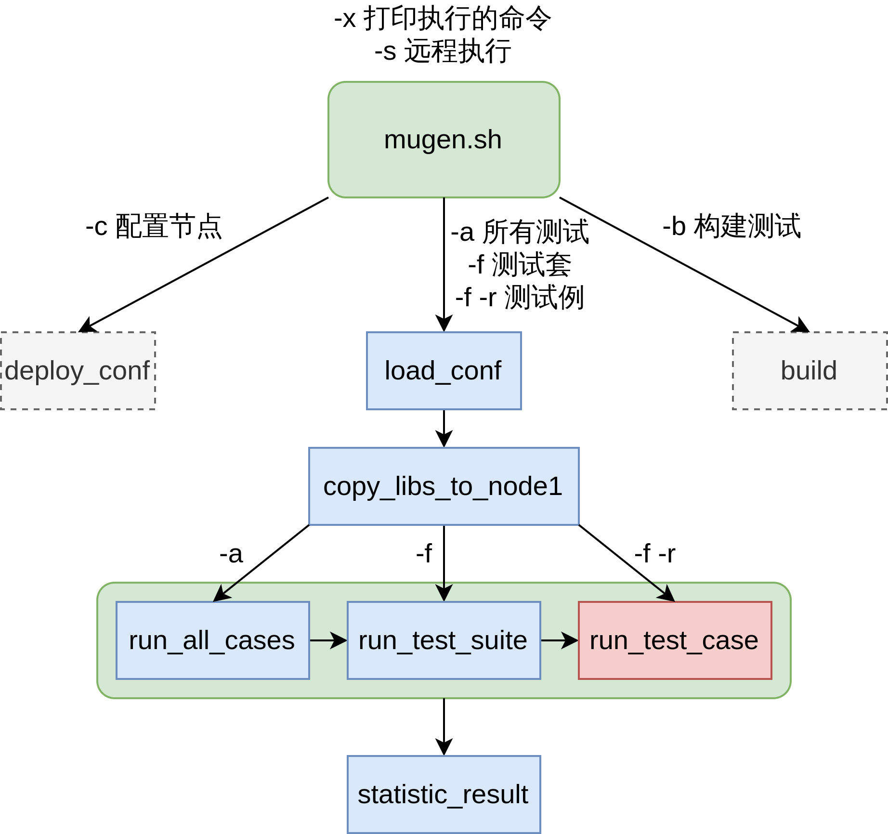

# mugen工具的使用和开发  
## mugen简介  
- mugen是什么
    - mugen是openEuler社区开放的测试框架，提供公共配置和方法以便社区开发者进行测试代码的编写和执行  
    - mugen提供了  
        - 丰富的openEuler测试代码（用于openEuler x86/AArch64 系统和软件功能的测试）  
        - 一套编写测试代码的规范（详见第四部分mugen测试开发）  
        - 辅助编写测试的函数库（详见mugen项目的文件结构和第四部分mugen测试开发）  
        - 一个能简化测试执行过程的执行程序（mugen.sh）  
    - mugen结构  
          
- mugen项目的文件结构及各目录作用 
    - 根目录下脚本  
        - dep_install.sh 用于依赖安装
        - mugen.sh mugen执行脚本   
    - suite2cases 测试套文件，一般和一个服务或软件对应，指定测试用例列表、文件路径和其他信息  
        - 例如clang.json  
            ```json  
            {
                "path": "$OET_PATH/testcases/cli-test/clang",
                "cases": [
                    {
                        "name": "oe_test_clang_01"
                    },
                    {
                        "name": "oe_test_clang_02"
                    },
                    {
                        "name": "oe_test_clang_03"
                    }
                ]
            }
            ```  
    - testcases 测试例代码  
        - cli-test  
        - doc-test  
        - embedded-test  
        - feature-test 特性测试（pkgship 软件包依赖管理工具）  
        - security-test 安全测试  
        - smoke-test 冒烟测试  
        - system-test 系统功能测试  
            - os-basic  
            - os-storage  
        - testsuite 示例  
    - libs/locallibs  
        - mugen本体使用的库  
        - 测试代码用库  
        - 共用库  
        - 库文件和各脚本的依赖关系  
              
    - doc 测试用例规范，定义了编写测试的要求  
    - License  
## mugen的安装、配置和运行  
- 安装  
    ```shell
    git clone https://gitee.com/openeuler/mugen.git
    cd mugen
    sudo bash dep_install.sh
    ```  
    或者https://github.com/brsf11/mugen-riscv.git  
- 配置  
    - mugen的节点
        - mugen有远程执行测试的功能，每一台机器（虚拟机或物理机），配置为一个节点  
        - 当前QEMU网络配置（用户模式）下远程执行会有问题  
    - 配置节点  
        ```shell
        bash mugen.sh -c --ip 127.0.0.1 --password openEuler12#$ --user root --port 22
        ```  
- 运行测试  
    - clang  
        ```shell  
        [root@openEuler-riscv64 mugen]# bash mugen.sh -f clang
        Mon Jul 11 13:37:31 2022 - INFO  - start to run testcase:oe_test_clang_03.
        Mon Jul 11 13:38:18 2022 - INFO  - The case exit by code 0.
        Mon Jul 11 13:38:19 2022 - INFO  - End to run testcase:oe_test_clang_03.
        Mon Jul 11 13:38:20 2022 - INFO  - start to run testcase:oe_test_clang_01.
        Mon Jul 11 13:38:46 2022 - INFO  - The case exit by code 0.
        Mon Jul 11 13:38:47 2022 - INFO  - End to run testcase:oe_test_clang_01.
        Mon Jul 11 13:38:49 2022 - INFO  - start to run testcase:oe_test_clang_02.
        Mon Jul 11 13:39:13 2022 - INFO  - The case exit by code 0.
        Mon Jul 11 13:39:14 2022 - INFO  - End to run testcase:oe_test_clang_02.
        Mon Jul 11 13:39:15 2022 - INFO  - A total of 3 use cases were executed, with 3 successes and 0 failures.
        ```
    - dnf  
        ```shell  
        [root@openEuler-riscv64 mugen]# bash mugen.sh -f dnf
        ...
        Mon Jul 11 13:46:53 2022 - INFO  - start to run testcase:oe_test_dnf_priority.
        Mon Jul 11 13:47:13 2022 - ERROR - The case exit by code 2.
        Mon Jul 11 13:47:14 2022 - INFO  - End to run testcase:oe_test_dnf_priority.
        Mon Jul 11 13:47:16 2022 - INFO  - start to run testcase:oe_test_dnf_reinstall_repoinfo.
        Mon Jul 11 13:50:39 2022 - ERROR - The case exit by code 4.
        Mon Jul 11 13:50:40 2022 - INFO  - End to run testcase:oe_test_dnf_reinstall_repoinfo.
        Mon Jul 11 13:50:41 2022 - INFO  - start to run testcase:oe_test_dnf_all-repos.
        Mon Jul 11 13:51:29 2022 - ERROR - The case exit by code 6.
        Mon Jul 11 13:51:29 2022 - INFO  - End to run testcase:oe_test_dnf_all-repos.
        ...
        Mon Jul 11 14:12:46 2022 - INFO  - A total of 22 use cases were executed, with 11 successes and 11 failures.
        ```  
        - 日志文件 logs/dnf/oe_test_dnf_all-repos/2022-07-12-00:29:34.log   
        ```  
        Tue Jul 12 00:29:37 2022 - INFO  - Start to run test.
        Error: Unknown repo: 'OS'
        Error: Unknown repo: 'everything'
        Error: Unknown repo: 'EPOL'
        Error: Unknown repo: 'debuginfo'
        ```  
        - openEuler RISC-V yum源配置原因  
        ```  
        # just for test
        [mainline]
        name=mainline
        baseurl=https://mirror.iscas.ac.cn/openeuler-sig-riscv/openEuler-RISC-V/testing>
        enabled=1
        gpgcheck=0
        # just for test
        [epol]
        name=epol
        baseurl=https://mirror.iscas.ac.cn/openeuler-sig-riscv/openEuler-RISC-V/testing>
        enabled=1
        gpgcheck=0
        [extra]
        name=extra
        baseurl=https://mirror.iscas.ac.cn/openeuler-sig-riscv/openEuler-RISC-V/testing>
        enabled=1
        gpgcheck=0
        ```  
## mugen基本测试原理  
- 测试运行流程   
    - mugen.sh函数调用过程  
          
    - testcase函数调用过程  
        - testcase代码结构  
            ```shell  
            source ${OET_PATH}/libs/locallibs/common_lib.sh #包含函数库
            function config_params() {}                     #需要预加载的数据、参数配置
            function pre_test() {}                          #测试对象、测试需要的工具等安装准备
            function run_test() {}                          #测试点的执行
            function post_test() {}                         #后置处理，恢复测试环境
            main "$@"                                       #运行测试
            ```  
        - 例如  
            ```shell  
            source "../common/common_lib.sh"

            function pre_test() {
                LOG_INFO "Start environmental preparation."
                DNF_INSTALL git-daemon
                LOG_INFO "End of environmental preparation!"
            }

            function run_test() {
                LOG_INFO "Start to run test."
                test_execution git.socket
                systemctl start git.socket
                systemctl reload git.socket 2>&1 | grep "Job type reload is not applicable for unit git.socket"
                CHECK_RESULT $?
                systemctl status git.socket | grep "Active: active"
                CHECK_RESULT $?
                LOG_INFO "End of the test."
            }

            function post_test() {
                LOG_INFO "start environment cleanup."
                DNF_REMOVE
                LOG_INFO "Finish environment cleanup!"
            }

            main "$@"
            ```
    - testcase执行函数调用过程  
        
## mugen测试的开发  
- 开发测试需要编写的文件  
    - testcase文件  
    - common文件（可选）  
    - suite2cases文件  
- testcase常见测试编写方法  
    - 合理运用mugen的库  
        - 全局common_lib  
            - LOG_INFO/WARN/DEBUG/ERROR() 用于打印信息  
            - CHECK_RESULT() 对比结果  
                - ```CHECK_RESULT $?``` 判断上一语句返回值是否为0，否则判错  
                - ```CHECK_RESULT $? 0 0 "log content"``` 判断上一语句返回值是否为0，否则判错并输出信息log content
            - DNF_INSTALL/REMOVE() 用于安装和卸载需要测试的软件包  
            - SLEEP_WAIT() 等待命令执行时长，超时判错  
        - cli-test中的systemd单元（详见 testcases/cli-test/common/common_lib.sh）   
- 测试代码开发例（GCC） 
    - testcase主体  
        ```shell  
        function pre_test() {
            LOG_INFO "Start to prepare the test environment."
            DNF_INSTALL gcc
            cp -r ../common ./tmp
            cd ./tmp
            LOG_INFO "End to prepare the test environment."
        }
        function run_test() {
            LOG_INFO "Start to run test."
            gcc test.c -o test
            CHECK_RESULT $?
            ./test | grep "Hello world!" > /dev/null
            CHECK_RESULT $?
            objdump -D ./test | grep "<main>" > /dev/null
            CHECK_RESULT $?
            LOG_INFO "End to run test."
        }
        function post_test() {
            LOG_INFO "Start to restore the test environment."
            rm -rf ./tmp
            DNF_REMOVE
            LOG_INFO "End to restore the test environment."
        }
        ```
    - common/test.c
        ```c
        #include<stdio.h>

        int main()
        {
            printf("Hello world!\n");
            return 0;
        }
        ```  
    - testsuite  
        ```json
        {
            "path": "$OET_PATH/testcases/cli-test/gcc",
            "cases": [
                {
                    "name": "oe_test_gcc"
                }
            ]
        }
        ```
    - 测试运行结果  
        ```shell  
       [root@openEuler-riscv64 mugen]# bash mugen.sh -f gcc
        Tue Jul 12 11:52:46 2022 - INFO  - start to run testcase:oe_test_gcc.
        Tue Jul 12 11:53:03 2022 - INFO  - The case exit by code 0.
        Tue Jul 12 11:53:04 2022 - INFO  - End to run testcase:oe_test_gcc.
        Tue Jul 12 11:53:04 2022 - INFO  - A total of 1 use cases were executed, with 1 successes and 0 failures. 
        ```
## RISC-V oE自动化测试脚本开发的工作和计划  
- 目前工作产出  
    - 初步整理了一部分可用于目前openEuler RISC-V镜像测试的测试套(7)和测试例(50)  
    - RISC-V oE自动化测试脚本  
        - openEuler的mugen项目目前用于openEuler x86/AArch64的测试，并不方便直接用于当前openEuler RISC-V的测试  
            - 测试项目（测试套）并不能很好地匹配  
            - 目前的openEuler RISC-V测试依靠QEMU虚拟机
        - mugen中一个测试套对应一个软件或服务，为了更方便地执行测试，可以再抽象一层  
        - 辅助测试脚本匹配测试列表和mugen中的测试套，并反馈缺失的测试和执行可用测试  
        - 使用  
            - 一例完整展示 list_riscv  
                - list_riscv  
                ```
                os-basic-riscv
                cpio
                git
                net-tools
                NetworkManager
                openslp
                util-linux
                ```  
                - 运行结果  
                ```shell
                [root@openEuler-riscv64 mugen-riscv]# python3 runtest.py list_riscv 
                Available test suites num = 390
                total test targets num = 7
                Unavailable test targets:
                Available test targets:
                os-basic-riscv
                cpio
                git
                net-tools
                NetworkManager
                openslp
                util-linux
                Target os-basic-riscv tested 39 cases, failed 4 cases                                                                                 
                Failed test: oe_test_server_httpd_port                                                                                                
                Failed test: oe_test_server_httpd_restart                                                                                             
                Failed test: oe_test_IOaccess_1Gfile                                                                                                  
                Failed test: oe_test_server_httpd_recover                                                                                             
                Target cpio tested 1 cases, failed 0 cases                                                                                            
                Target git tested 1 cases, failed 0 cases                                                                                             
                Target net-tools tested 1 cases, failed 0 cases                                                                                       
                Target NetworkManager tested 4 cases, failed 1 cases                                                                                  
                Failed test: oe_test_service_NetworkManager                                                                                           
                Target openslp tested 1 cases, failed 0 cases                                                                                         
                Target util-linux tested 3 cases, failed 0 cases                                                                                      
                100%|█████████████████████████████████████| 7/7 [2:15:00<00:00, 1157.27s/case]

                ```  
- 未来计划  
    - 继续整理可用于openEuler RISC-V测试的mugen测试例  
    - 完善RISC-V oE自动化测试脚本，将mugen测试自动化，和镜像发布流程整合  
    - 新的测试脚本开发  
    - 提高测试速度  