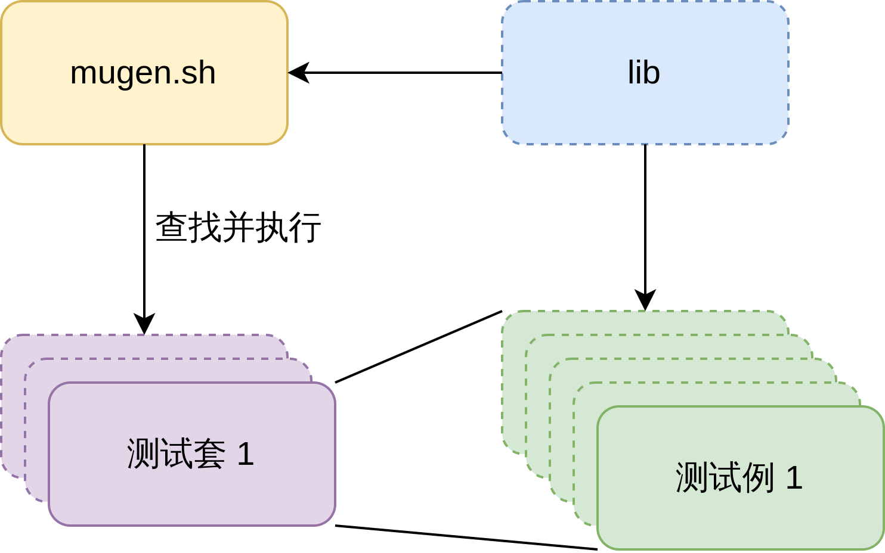

# mugen工具的使用和开发  
## mugen简介  
- mugen是什么（图说明mugen、测试套、测试例的关系），有什么用  
    - mugen是openEuler社区开放的测试框架，提供公共配置和方法以便社区开发者进行测试代码的编写和执行  
    - mugen结构  
          
- mugen项目的文件结构（图）及各目录作用  
    - doc 测试用例规范  
    - libs/locallibs  
        - mugen本体使用的库  
            - 
        - 测试代码用库  
        - 共用库  
    - License  
    - suite2cases 测试套文件  
    - testcases 测试例代码  
        - cli-test  
        - doc-test  
        - embedded-test  
        - feature-test 特性测试（pkgship 软件包依赖管理工具）  
        - security-test 安全测试  
        - smoke-test 冒烟测试  
        - system-test 系统功能测试  
            - os-basic  
            - os-storage  
        - testsuite 示例
    - 根目录下脚本  
        - dep_install.sh
        - mugne.sh  
        - qemu_ctl.sh  
        - runoet.sh  
- mugen对openEuler RISC-V有什么用  
    - 用于自动化测试系统基本功能和软件  
## mugen的安装、配置和运行  
- 依赖安装  
    ```shell
    sudo bash dep_install.sh
    ```
- 配置  
    - mugen的节点  
    - 配置节点  
    ```shell
    bash mugen.sh -c --ip 127.0.0.1 --password openEuler12#$ --user root --port 22
    ```
- 运行测试  
    - 成功一例 clang  
    ```shell  
    [root@openEuler-riscv64 mugen]# bash mugen.sh -f clang
    Mon Jul 11 13:37:31 2022 - INFO  - start to run testcase:oe_test_clang_03.
    Mon Jul 11 13:38:18 2022 - INFO  - The case exit by code 0.
    Mon Jul 11 13:38:19 2022 - INFO  - End to run testcase:oe_test_clang_03.
    Mon Jul 11 13:38:20 2022 - INFO  - start to run testcase:oe_test_clang_01.
    Mon Jul 11 13:38:46 2022 - INFO  - The case exit by code 0.
    Mon Jul 11 13:38:47 2022 - INFO  - End to run testcase:oe_test_clang_01.
    Mon Jul 11 13:38:49 2022 - INFO  - start to run testcase:oe_test_clang_02.
    Mon Jul 11 13:39:13 2022 - INFO  - The case exit by code 0.
    Mon Jul 11 13:39:14 2022 - INFO  - End to run testcase:oe_test_clang_02.
    Mon Jul 11 13:39:15 2022 - INFO  - A total of 3 use cases were executed, with 3 successes and 0 failures.
    ```
    - 失败一例 dnf  
    ```shell  

    ```
    - 失败一例 osc  
    ```shell  

    ```
- 辅助测试脚本  
    - 功能  
    - 使用  
        - 一例完整展示 list_test  
        - 一例展示测试列表比对 list_minimal  
## mugen基本测试原理  
- 测试运行流程   
    - mugen.sh函数调用过程（图）  
    - testcase函数调用过程例1（图）  
    - testcase函数调用过程例2（图）  
- 测试失败分析  
    - 失败一例附原因解析 dnf  
    - 失败一例附原因解析 osc    
## mugen测试的开发  
- 开发测试需要编写的文件  
    - testcase文件  
    - common文件（可选）  
    - suite2cases文件  
- testcase常见测试编写方法  
    - 合理运用mugen的库  
        - 全局common_lib  
            - LOG_INFO/WARN/DEBUG/ERROR()  
            - CHECK_RESULT()  
            - DNF_INSTALL/REMOVE()  
            - SLEEP_WAIT()  
        - cli-test中的systemd单元  
            - 例1  
            - 例2  
- 测试代码开发例（GCC） 
## 待完成的工作  
- 开发mugen测试代码  
    - 从mugen自带的测试代码中选出可用于openEuler RISC-V测试的  
    - 找到并编写mugen自带测试代码中缺少的测试  
    - 最终形成一个测试列表  
- mugen的其他功能（如远程执行测试、machine type、machine num等）  
- 完善辅助测试脚本，实现更多功能  